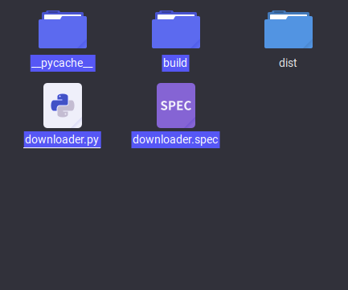

# portable-youtube-downloader
A portable youtube downloader with linux and windows support. Download binary package from [here](https://github.com/KBHamster/portable-youtube-downloader/releases) and run it. Single file, no installation, no depencities!

## MacOS Support
I'm not giving any support please go to app store and download some 50$ spyware filled youtube downloader made with electron

## Compiling (for devs)
The final result will be only compatilable with the os you used to compile it. For example if you compile it on linux then the final result will be only compatilable glorious penguin os.

### Compiling on linux
First, we need to install depencities in order to run it directly from source and pyinstaller in order to compile it.
```
[your python interpreter] -m pip install pysimplegui youtube-dl pyinstaller

Example: python3.9 -m pip install pysimplegui youtube-dl pyinstaller
```
After installation try running script with `python3.9 ./downloader.py` and see if it works. If it works then you can compile it using pyinstaller. 

If you are using an ubuntu or debian based distro then you must install python dev package

```
sudo apt install [your python interpreter]-dev

Example: sudo apt install python3.9-dev
```
Once it finishes installing you can compile it by this command `python3.9 -m PyInstaller --onefile --console  "./downloader.py"`. The executable will be moved into dist folder inside the project folder. You can delete other folders if you wish.



*you can delete these files if you wish*

### Compiling on Micro$oft Winblow$
[This section is not written yet]
